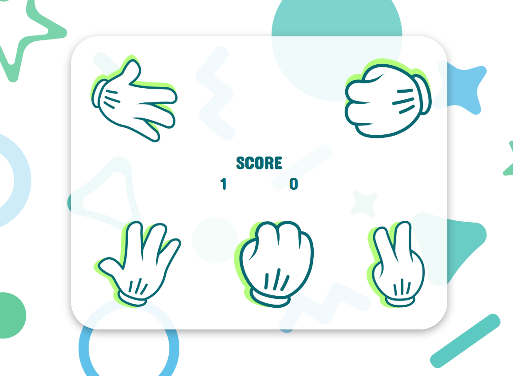

# Rock Paper Scissors ✊✋✌️

> A simple browser game where you challenge the computer in the classic battle of Rock 🪨, Paper 📄, and Scissors ✂️.

---

## 🖼️ Preview

  

*Example of an ongoing match: you chose Paper, the computer chose Rock, you won that round!* 😉

---

## 🎮 How it Works

1. **Choose Rounds:** On page load, enter how many rounds you want to play (e.g., 3, 5, 10).
2. **Play Rounds:** For each round:
   - Click one of the three icons (Rock, Paper, Scissors).
   - The computer makes a random choice.
   - Scores update live (your score vs. computer score).
3. **Match End:** After the selected rounds:
   - A final message declares **Victory**, **Defeat**, or **Draw** based on overall score.
   - Click the **Restart** button (🔄) to play again.

---

## ✨ Features

- **Round Selector:** Customize how many rounds you play.
- **Interactive UI:** Clickable icons with instant feedback.
- **Live Scoring:** Track both player and computer points.
- **Endgame Screen:** Final result message plus a Restart button.

---

## 📝 Code Structure

- **`index.html`** – Main HTML layout
- **`style.css`** – Styling
- **`script.js`** – Game logic
- **`images/`** – Assets